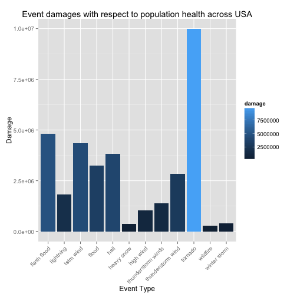
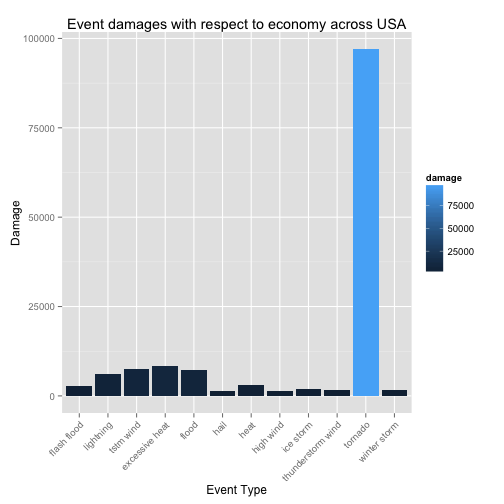

Impact of Natural Calamities on Economy and Health. Is Tornado winner?
========================================================

## Synopsis

In this project, I attempt to find out the impact of natural events on economy and health from year 1950 to November 2011. I have used NOAA Storm Database to support my claims and analysis. Natural calamities such as storms, tornado and severe wheather events can disrupt our daily lives, cause huge damage to our economy and as well health. 

With the NOAA Storm Database, I explore and try to find out which events are most harmful. Torndao is most likely the winner.

## Data
The data comes from U.S. National Oceanic and Atmospheric Administration in csv, compressed in bz2 and following is the link to download the data and also relevant documents. 

 1. [The main NOAA database](https://d396qusza40orc.cloudfront.net/repdata%2Fdata%2FStormData.csv.bz2)
 2. [National Weather Service Storm Data Documentation](https://d396qusza40orc.cloudfront.net/repdata%2Fpeer2_doc%2Fpd01016005curr.pdf)
 3. [National Climatic Data Center Storm Events FAQ](https://d396qusza40orc.cloudfront.net/repdata%2Fpeer2_doc%2FNCDC%20Storm%20Events-FAQ%20Page.pdf)

The events in the database start in the year 1950 and end in November 2011. In the earlier years of the database there are generally fewer events recorded, most likely due to a lack of good records. More recent years should be considered more complete.

## Data processing
Before actually start the data process, it is better to irrelevant columns in the data frame and also clean the data. We also need to calculate numeric value of the damage and it is done by factoring the exponent. 


```r
# set the working directory where 'repdata-data-StormData.csv' resides
setwd("/Users/avi/Documents/code/coursera/repdata/cp2/")
# now load the date into a variable stormData <-
# read.table('repdatadataStormData.csv', header = T, sep = ',')
stormData <- read.table("repdatadataStormData.csv.bz2", header = T, sep = ",")
```


We are going to find out which events have caused most economic and health damages. So we will keep only these columns related to health and ecomony viz. "FATALITIES", "INJURIES", "PROPDMG", "PROPDMGEXP", "CROPDMG", "CROPDMGEXP".


```r
stormData <- stormData[, c("EVTYPE", "FATALITIES", "INJURIES", "PROPDMG", "PROPDMGEXP", 
    "CROPDMG", "CROPDMGEXP")]
```


Now we have to calculate numeric values for the damages:

```r
levels(stormData$PROPDMGEXP) <- c("1", "1", "1", "1", "1", "1", "1", "1", "1", 
    "1", "1", "1", "1", "1000000000", "1", "1", "1000", "1000000", "1000000")
levels(stormData$CROPDMGEXP) <- c("1", "1", "1", "1", "1000000000", "1000", 
    "1000", "1000000", "1000000")
stormData$PROPDMG <- stormData$PROPDMG * as.integer(stormData$PROPDMGEXP)
stormData$CROPDMG <- stormData$CROPDMG * as.integer(stormData$CROPDMGEXP)
```


It's also better to clean the Event types column. And add up health and economy damages

```r
levels(stormData$EVTYPE) <- gsub("[^a-zA-Z]", " ", tolower(levels(stormData$EVTYPE)))
levels(stormData$EVTYPE) <- gsub("^\\s+", "", levels(stormData$EVTYPE))
levels(stormData$EVTYPE) <- gsub("\\s+$", "", levels(stormData$EVTYPE))
levels(stormData$EVTYPE) <- gsub("\\s+", " ", levels(stormData$EVTYPE))
stormData$propDamage <- stormData$PROPDMG + stormData$CROPDMG
stormData$healthDamage <- stormData$FATALITIES + stormData$INJURIES
```


## Results
### Analysis
Now we have the data required and we have cleaned it to some extent. Lets create two separate datasets for each health and economy 

```r
healthData <- stormData[, c("EVTYPE", "FATALITIES", "INJURIES", "healthDamage")]
ecoData <- stormData[, c("EVTYPE", "PROPDMG", "CROPDMG", "propDamage")]
ecoDataRep <- aggregate(ecoData$propDamage, by = list(ecoData$EVTYPE), FUN = sum, 
    na.rm = TRUE)
colnames(ecoDataRep) <- c("EVTYPE", "damage")
healthDataRep <- aggregate(healthData$healthDamage, by = list(healthData$EVTYPE), 
    FUN = sum, na.rm = TRUE)
colnames(healthDataRep) <- c("EVTYPE", "damage")
```


Lets get the top 12 event types, in each health and economy data sets, which have caused most damage.

```r
topEcoEvents <- ecoDataRep[order(-ecoDataRep$damage), ][1:12, ]
topHealthEvents <- healthDataRep[order(-healthDataRep$damage), ][1:12, ]
```


### Visualization
**Plot for top 12 event types causing highest damage to health:**


```r
require(ggplot2)
```

```
## Loading required package: ggplot2
```

```r
ggplot(topEcoEvents, aes(x = EVTYPE, y = damage)) + geom_bar(stat = "identity", 
    aes(fill = damage), position = "dodge") + theme(axis.text.x = element_text(angle = 45, 
    hjust = 1)) + xlab("Event Type") + ylab("Damage") + ggtitle("Event damages with respect to population health across USA")
```

 


**Plot for top 12 event types causing highest damage to economy:**


```r
ggplot(topHealthEvents, aes(x = EVTYPE, y = damage)) + geom_bar(stat = "identity", 
    aes(fill = damage), position = "dodge") + theme(axis.text.x = element_text(angle = 45, 
    hjust = 1)) + xlab("Event Type") + ylab("Damage") + ggtitle("Event damages with respect to economy across USA")
```

 


## Conclusion
From above graphs its evident that Tornado is the winner causing most damage to economy and also to health of people across USA.

## Author
Author of this document is [avinassh](http://github.com/avinassh). You are free copy this document, with or without giving me credit. Repositary with links and all the raw data is available [here](https://github.com/avinassh/repdata-cp2)
